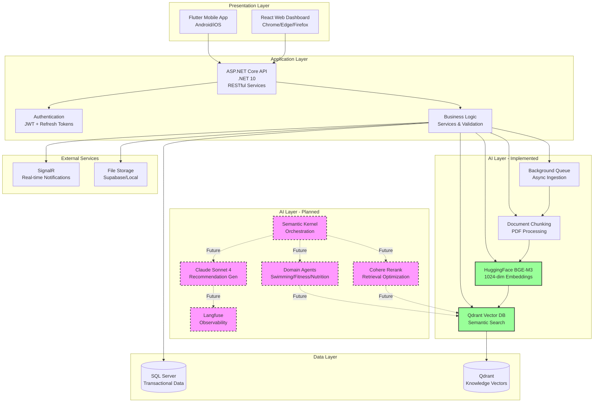
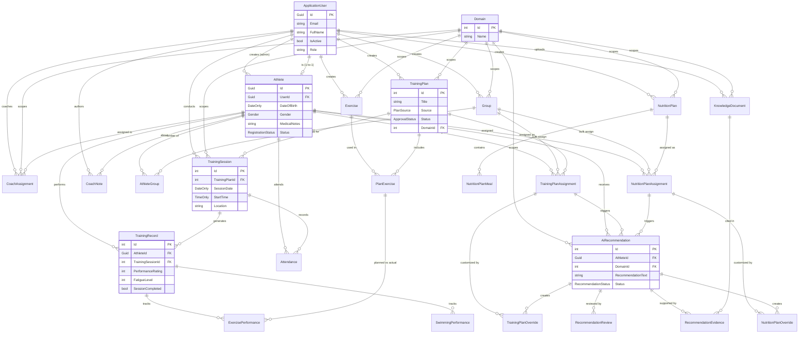
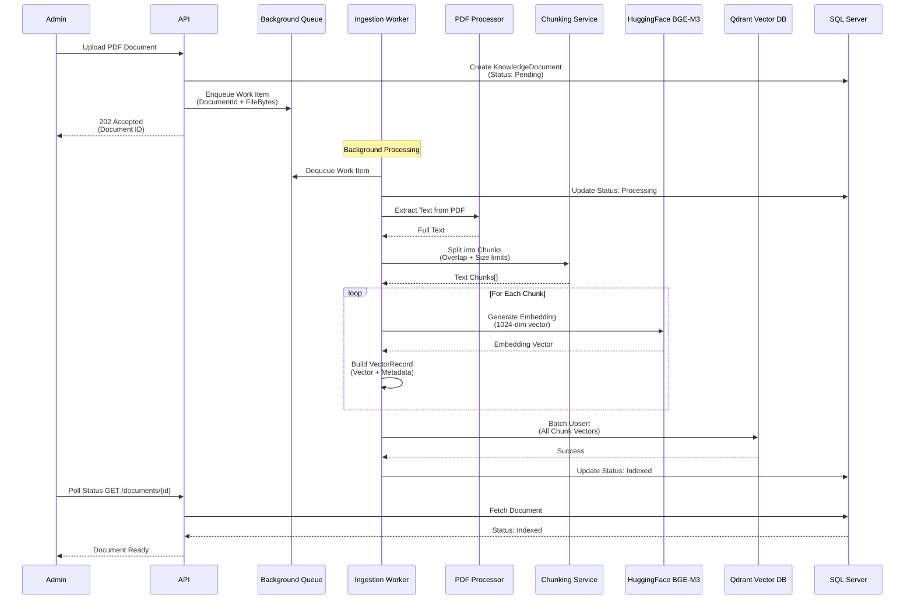
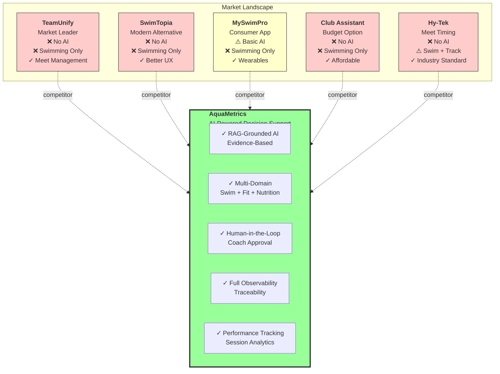
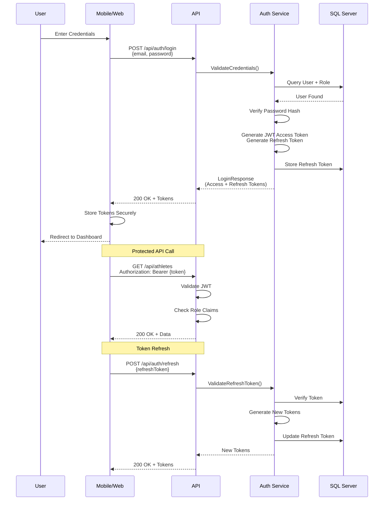
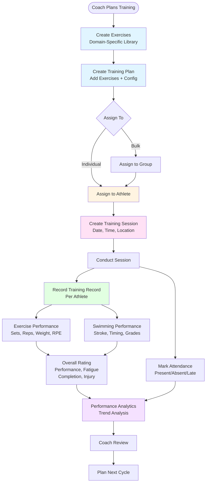
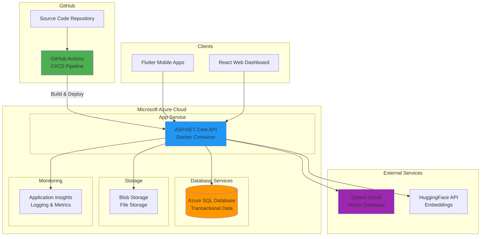
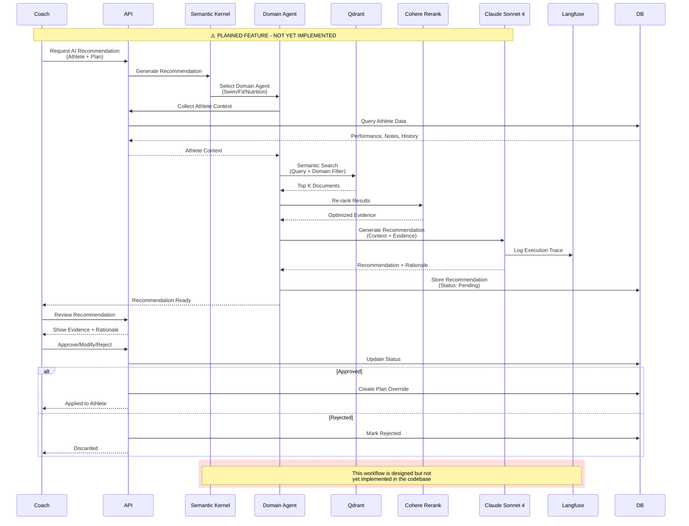
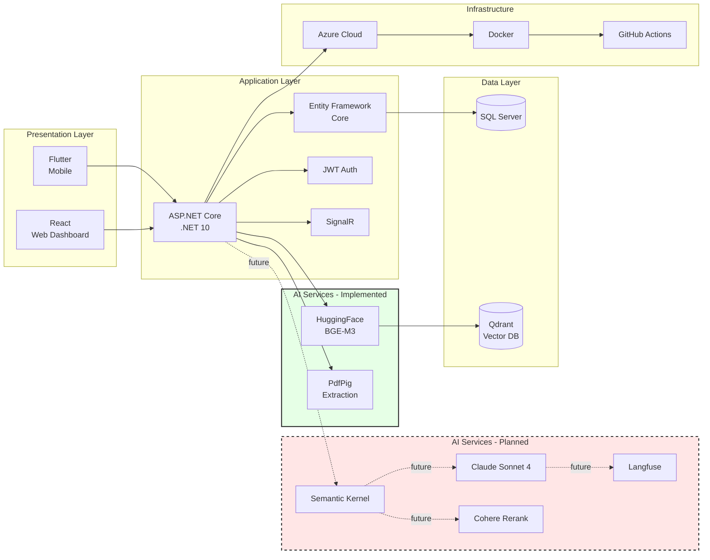

# AquaMetrics SRS Diagrams (Mermaid Source)

## 1. System Architecture Diagram

## 2. Database Entity Relationship Diagram (Conceptual)

## 3. RAG Pipeline Diagram (Implemented)

## 4. Competitive Analysis Matrix

## 5. Authentication Flow

## 6. Training Workflow (Actual Implementation)

## 7. User Roles & Permissions

```mermaid
graph TB
    subgraph Roles
        Admin[<b>Administrator</b><br/>Full System Access]
        SwimCoach[<b>Swimming Coach</b><br/>Swimming Domain]
        FitCoach[<b>Fitness Coach</b><br/>Fitness Domain]
        NutSpec[<b>Nutrition Specialist</b><br/>Nutrition Domain]
        Athlete[<b>Athlete</b><br/>View Only]
    end
    
    subgraph AdminPerms["Admin Permissions"]
        A1[User Management]
        A2[Athlete Registration]
        A3[Coach Assignments]
        A4[Knowledge Base Management]
        A5[System Configuration]
    end
    
    subgraph CoachPerms["Coach Permissions"]
        C1[Create Training Plans]
        C2[Create Exercises]
        C3[Create Groups]
        C4[Assign Plans]
        C5[Schedule Sessions]
        C6[Record Attendance]
        C7[Record Performance]
        C8[Coach Notes]
        C9[View Assigned Athletes]
    end
    
    subgraph AthletePerms["Athlete Permissions"]
        AT1[View Own Profile]
        AT2[View Training Plans]
        AT3[View Performance History]
        AT4[View Notifications]
    end
    
    Admin --> A1
    Admin --> A2
    Admin --> A3
    Admin --> A4
    Admin --> A5
    
    SwimCoach --> C1
    SwimCoach --> C2
    SwimCoach --> C3
    SwimCoach --> C4
    SwimCoach --> C5
    SwimCoach --> C6
    SwimCoach --> C7
    SwimCoach --> C8
    SwimCoach --> C9
    
    FitCoach --> C1
    FitCoach --> C2
    FitCoach --> C3
    FitCoach --> C4
    FitCoach --> C5
    FitCoach --> C6
    FitCoach --> C7
    FitCoach --> C8
    FitCoach --> C9
    
    NutSpec --> C1
    NutSpec --> C4
    NutSpec --> C8
    NutSpec --> C9
    
    Athlete --> AT1
    Athlete --> AT2
    Athlete --> AT3
    Athlete --> AT4
    
    style Admin fill:#ff9999
    style SwimCoach fill:#99ccff
    style FitCoach fill:#99ff99
    style NutSpec fill:#ffcc99
    style Athlete fill:#cc99ff
```

## 8. Deployment Architecture

## 9. AI Recommendation Workflow (Planned - Not Yet Implemented)

## 10. Technology Stack Summary

